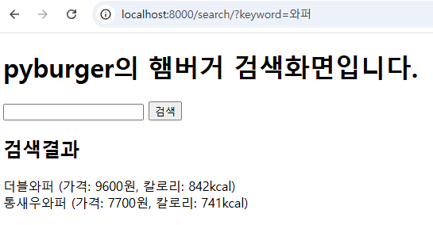

# PyBurger 프로젝트
이 프로젝트는 이한영의 장고 입문에 실린 PyBurger 프로젝트를 기반으로 한 클론 코딩 프로젝트입니다.
Django 프레임워크를 활용하여 웹 애플리케이션을 구축하며, 프로젝트 구성, 데이터베이스 연동, 템플릿 렌더링 등 Django 기초 기능을 실습했습니다.
또한, 책 내용 이외에 Docker에 대해 학습하여 Docker 기반의 개발 환경을 구축하고, 컨테이너에서 프로젝트를 실행할 수 있도록 설정했습니다.

## 주요 학습 내용
1. Django 프로젝트 구성
- **프로젝트 구조**: Django의 기본 폴더 구성과 주요 파일(settings.py, urls.py, views.py)의 역할을 파악하고 Django 앱의 기본적인 구조를 익혔습니다.
- **데이터베이스 ORM**: 모델을 정의하고 Django ORM을 통해 데이터베이스와 상호작용하는 방법을 학습했습니다.
- **템플릿**: HTML를 이용하여 페이지를 구성하는 방법을 익혔습니다.

2. Docker 기반 개발 환경 설정
- Docker를 사용하여 개발 환경을 구축하고, 애플리케이션을 컨테이너에서 실행할 수 있도록 설정했습니다. 
- Docker Compose로 필요한 설정을 자동화하여 일관된 개발 환경에서 개발할 수 있도록 하였습니다.

## 설정 및 실행
1. 저장소 클론
    ``` bash
    git clone https://github.com/rlozl15/pyburger.git
    cd pyburger
    ```

2. Docker 환경 준비
   - Docker Desktop을 실행합니다.

3. Docker 이미지 빌드 및 실행
    ``` bash
    docker-compose up -d --build
    ```

4. Django 앱 및 마이그레이션
   - 데이터베이스 테이블을 생성하고 앱을 등록하기 위한 마이그레이션을 수행합니다.
    ``` bash
    docker-compose exec app python manage.py migrate
    ```

5. 버거 데이터 임의 추가
    ``` bash
    docker-compose exec app python manage.py loaddata burgers/fixtures/burgers.json
    ```

6. Django 서버 확인
   - http://localhost:8000에서 Django 애플리케이션에 접근할 수 있습니다.
   
   - 

## 사용 기술
    - 백엔드: Django
    - 프론트엔드: HTML, Django 템플릿
    - 데이터베이스: Django ORM (SQLite3)
    - 컨테이너: Docker
